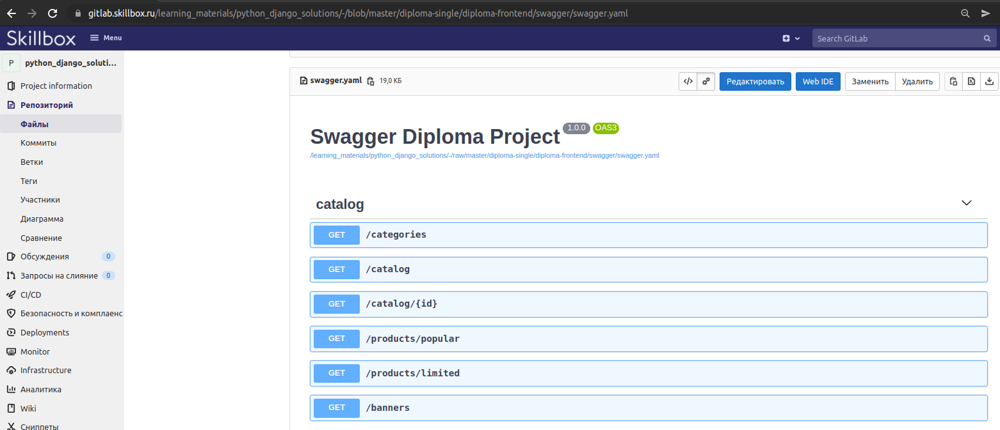
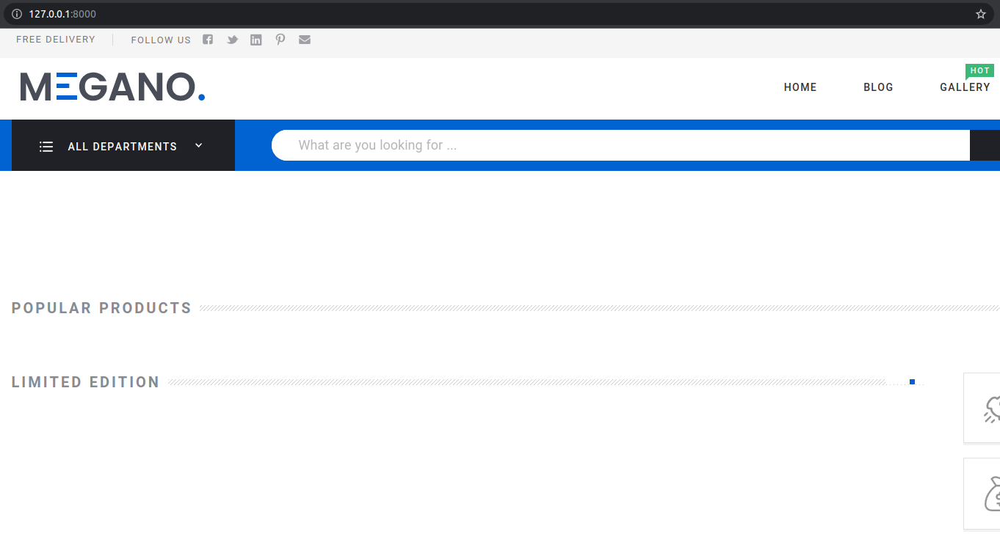

# Общая часть

## Что из себя представляет проект
Предтаавляет собой подключаемое django-приложение. Берет на себя все что связано с отобоажением страниц, а обращение 
за данными происходит по API, который необходимо реализовать в ходе выполения задания дипломного проекта.

##
Базовый процесс разворачивания проекта:
● git clone;
● изменение файла .env;
● pip install -r requirements.txt;
● другие шаги по настройке (возможно подключение пакета frontend 0.6);
● python manage.py migrate;
● python manage.py runserver 0.0.0.0:8000

## Структура сайта

API предоставляет эндпоинты:

api/sign-out/ -  выход из аккаунта пользователя
api/sign-in/ - для авторизации пользователя
api/sign-up - для регистрации нового пользователя

api/categories/ -  данные для категорий
api/catalog/ -  данные для каталога
api/products/popular/ -  данные для отображения  популярных товаров
api/products/limited/ -  данные для отображения  товара лимитированного тиража
api/sales -  данные для отображения товара со скидкой
api/banners/ -  данные для отображения баннеров

api/cart - данные для отображения корзины пользователя
api/basket - добавление/удаление товара из корзины пользователя

api/orders - данные для отображения списка заказов 
api/order/<int:id> - данные для отображения деталей заказа

api/payment/<int:id> - передает данные для оплаты заказа

api/profile - данные для профиля зарегистрированного пользователя
api/profile/avatar -  данные для изменения аватара пользователя
api/profile/password -  данные для изменения пароля пользователя

api/tags/ -  данные по тэгам

api/product/<int:id>/ - данные с деталями товара
api/product/<int:id>/reviews/ - данные отзывов на товар

## Контракт для API
Названия роутов и ожидаемую структуру ответа от API endpoints можно найти в `diploma-frontend/swagger/swagger.yaml`. 
Для более удобного просмотра swagger-описания рекомендуется использовать возможности gitlab:


## Подключение пакета
1. Собрать пакет: в директории diploma-frontend выполнить команду python setup.py sdist
2. Установить полученный пакет в виртуальное окружение: `pip install diploma-frontend-X.Y.tar.gz`. X и Y - числа, они могут изменяться в зависимости от текущей версии пакета.
3. В `settings.py` дипломного проекта подключить приложение:
```python
INSTALLED_APPS = [
        ...
        'frontend',
    ]
```
4. В `urls.py` добавить:
```python
urlpatterns = [
    path("", include("frontend.urls")),
    ...
]
```
Если запустить сервер разработки: `python manage.py runserver`, то по адресу `127.0.0.1:8000` должна открыться стартовая страница интернет-магазина:


# Детали подключаемого приложения `frontend` (Для проверяющих преподавателей)
Приложение служит только для отрисовки шаблонов из `templates/frontend`, поэтому в `urls.py` напрямую 
используются `TemplateView` из стандартной поставки Django.

В качестве frontend фреймворка был использован Vue3, который подключается в базовом шаблоне `templates/frontend/base.html`:
```html
<script src="https://unpkg.com/vue@3/dist/vue.global.js"></script>
```
JS скрипт `static/frontend/assets/js/app.js` содержит реализацию Vue объекта, а все остальные JS скрипты из 
директории `static/frontend/assets/js` реализуют объекты примеси для соответствующей страницы проекта.


